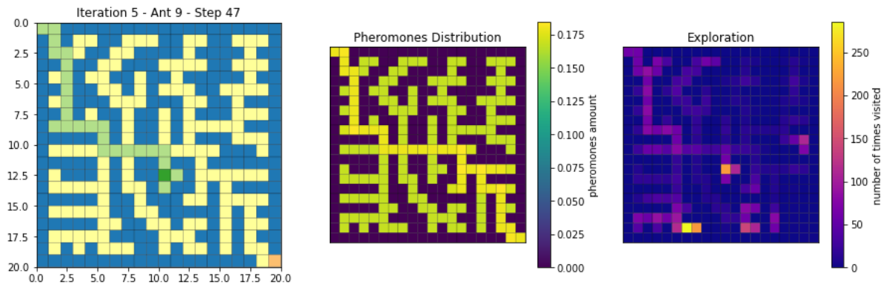

# ACO_Random_Walk

[**Project page**](https://zosov.github.io/portfolio/aco_path_planning/)

This research work proposes a promising method to initialize pheromones in an Ant Colony Optimization (ACO) algorithm through random walks. Further, this research aims to lay the foundations for future research in the area, especially to find efficient ways to generate prior knowledge for ACO algorithms.

NOTE: This repository is an extended and updated version of the work [PathPlanningACO](https://github.com/ZosoV/PathPlanningACO).

## How to explore the project

* **Model**. In the folder model, [model/aco.py](./model/aco.py) encloses the ACO algorithm class, as well as the ACO version for Path Planning, named `ACOPP`. Additionally, the main algorithm for reproducing the graph environment was coded in [model/graph_env.py](./model/graph_env.py). Note the ACO algorithm used in this work is based on an Ant Colony System (ACS), well described in *Dorigo, Marco, Mauro Birattari, and Thomas Stutzle. "Ant colony optimization." IEEE computational intelligence magazine 1.4 (2006): 28-39.* [[article]](https://ieeexplore.ieee.org/abstract/document/4129846)

* **Random Walk**. The script [random_walk/walker.py](./random_walk/walker.py) held the main walker agent class. In addition, [random_walk/rw_models.py](./random_walk/rw_models.py) encloses all the proposed random walks. Note that each random walk inherits the main class, `Walker`. The proposed random walks are

    * Proximity Random Walk (PRW)
    * Greedy Randm Walk (GRW)
    * Levy Flight + PRW
    * Levy Flight + GRW

* **Notebooks**. The notebooks are designed so that almost all requirements are contained; or in other words, it is not necessary to export additional libraries. Therefore, if you want to understand the code, we suggest to start with these notebooks.
    * [notebooks/aco_pp.ipynb](./notebooks/aco_pp.ipynb) encloses the main ACO algorithm for solving path planning problem. Some dilemmas and additional strategies like `proximity` and `penalty` are explained here.
    * [notebooks/random_walks.ipynb](./notebooks/random_walks.ipynb) encloses the main algorithms proposed to perform the random walks.
    * [notebooks/proximities_testing.ipynb](notebooks/proximities_testing.ipynb) encloses a small test where we checked the proximity measurements and how the different normalization techniques could change the proximity distribution.

    Additional Notebooks.
    * [notebooks/aco_tsp.ipynb](./notebooks/aco_tsp.ipynb) encloses an additional algorithm for solving the Travelling Salesman Problem with an ACO algorithm
    * [notebooks/random_maze.ipynb](./notebooks/random_maze.ipynb) encloses an algorithm to create random mazes in a graph environment.

* **Test**. We added some test scripts where we performed our experiments. Each file accepts some parameters for executing. It is important to create an `.xlsx` file to perform new experiments. You can find some examples of those files here [stuff/experiments/](./stuff/experiments/).
    * [test_aco.py](./test_aco.py) corresponds to the experiments with only the `ACOPP` algorithm, and the results were displayed in [notebooks/display_results_test_aco.ipynb](notebooks/display_results_test_aco.ipynb).
    * [test_rw.py](./test_rw.py) corresponds to the experiments where we tested the proposed `random walks` methods, and the results were displayed in [notebooks/display_results_test_rw.ipynb](notebooks/display_results_test_rw.ipynb).
    * [test_aco_rw.py](./test_aco_rw.py) corresponds to the experiments with the `rando walks` + `ACOPP`, and the results were displayed in [notebooks/display_results_test_aco_rw.ipynb](notebooks/display_results_test_aco_rw.ipynb).

* **Utils**. This folder encloses [utils/measures.py](./utils/measures.py) for measuring the proximity and distance and [utils/visualization.py](./utils/visualization.py) to perform some visualizations in a loop.
